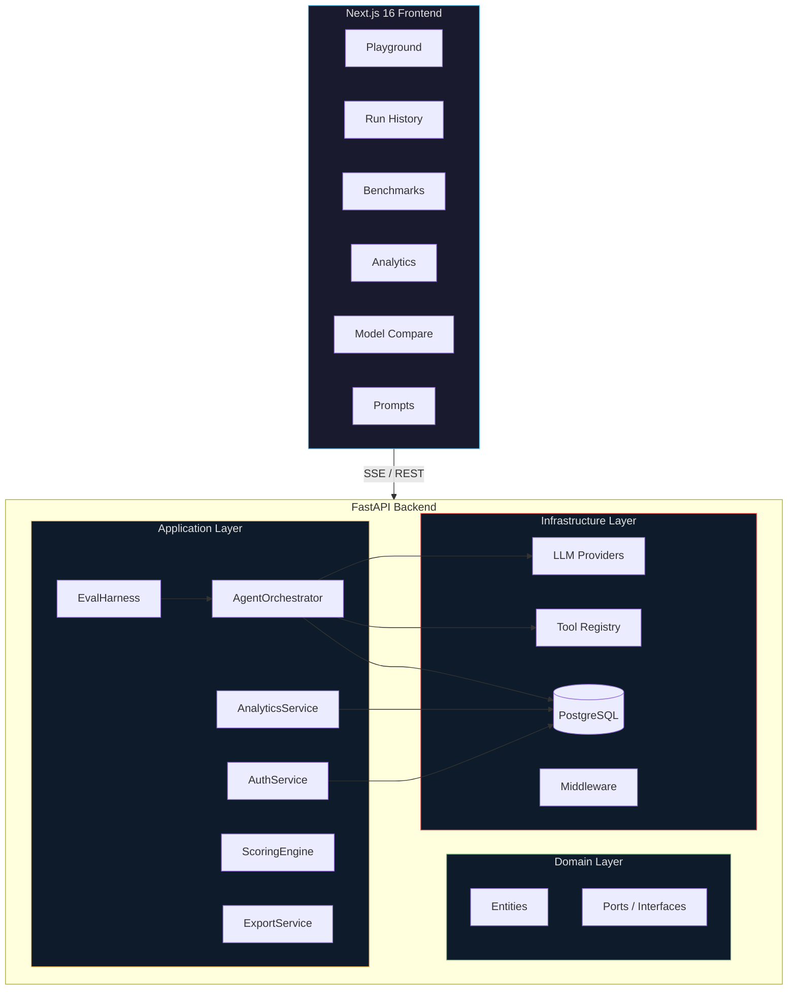
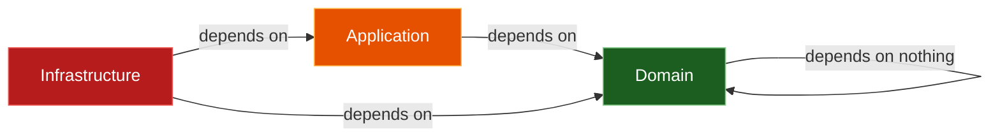
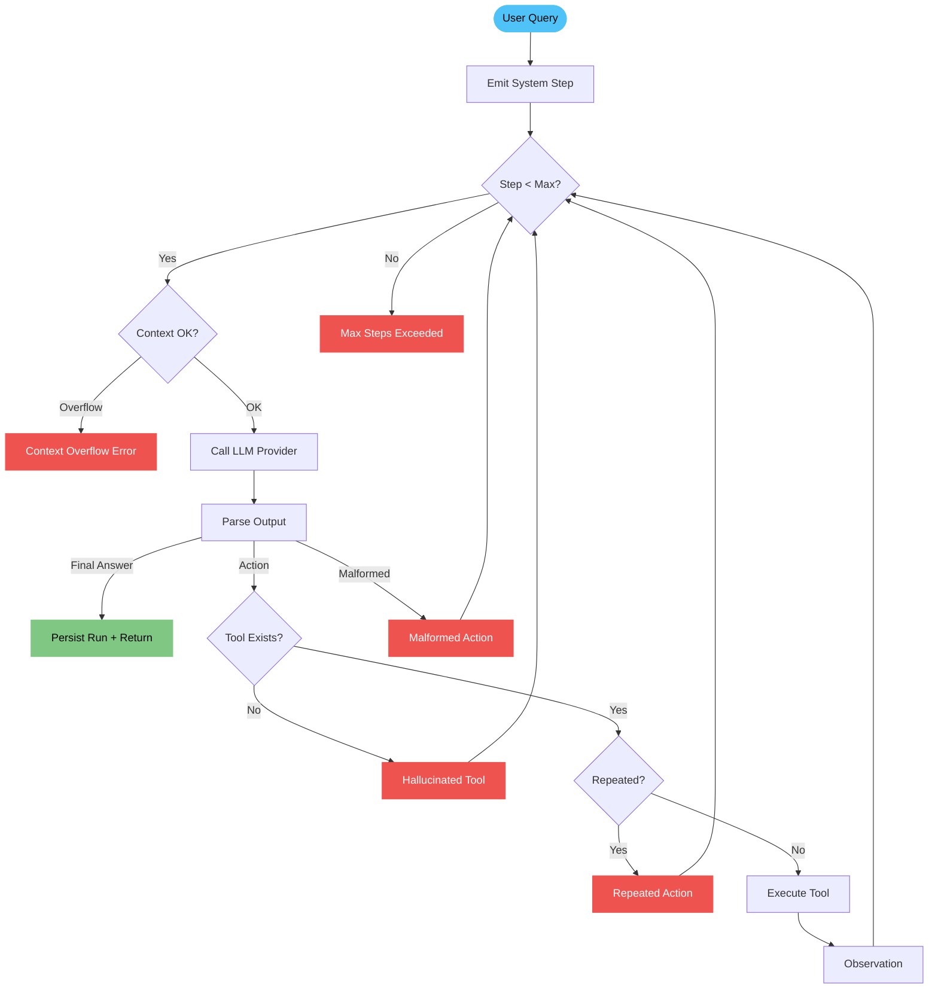
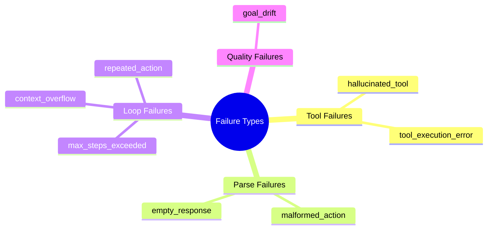
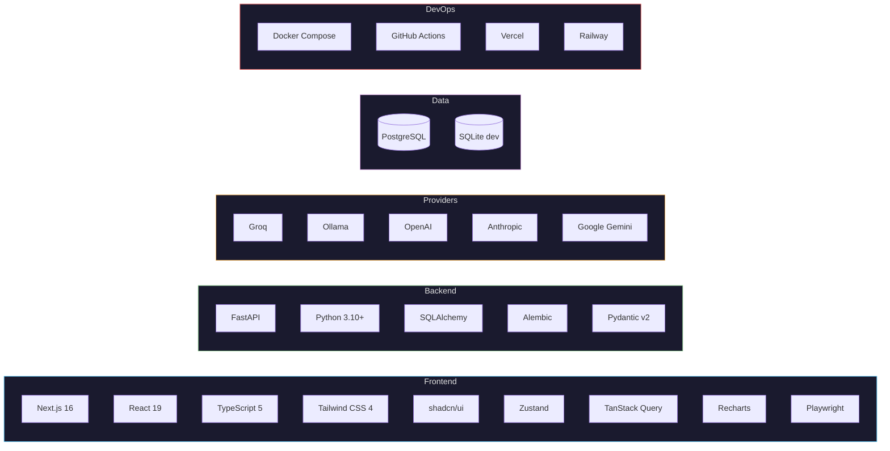
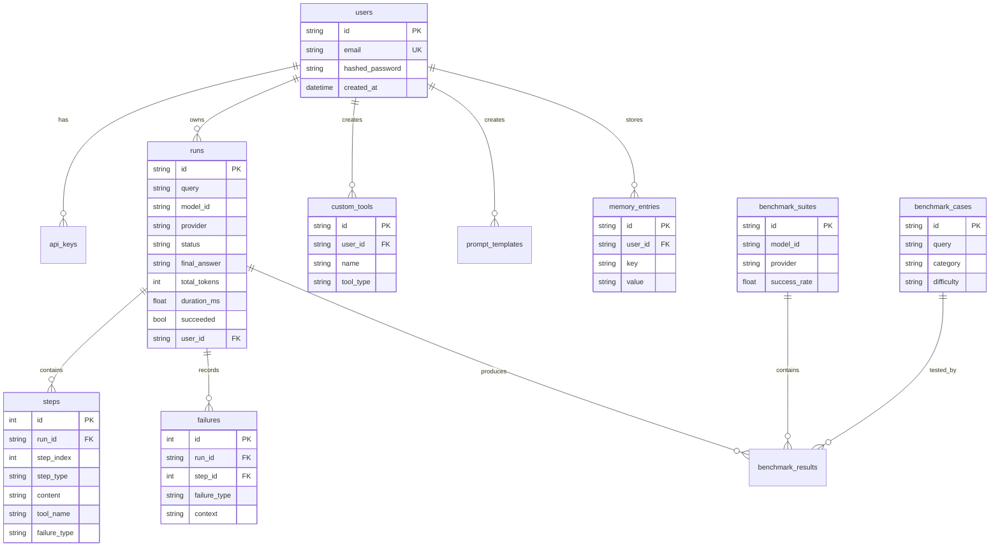
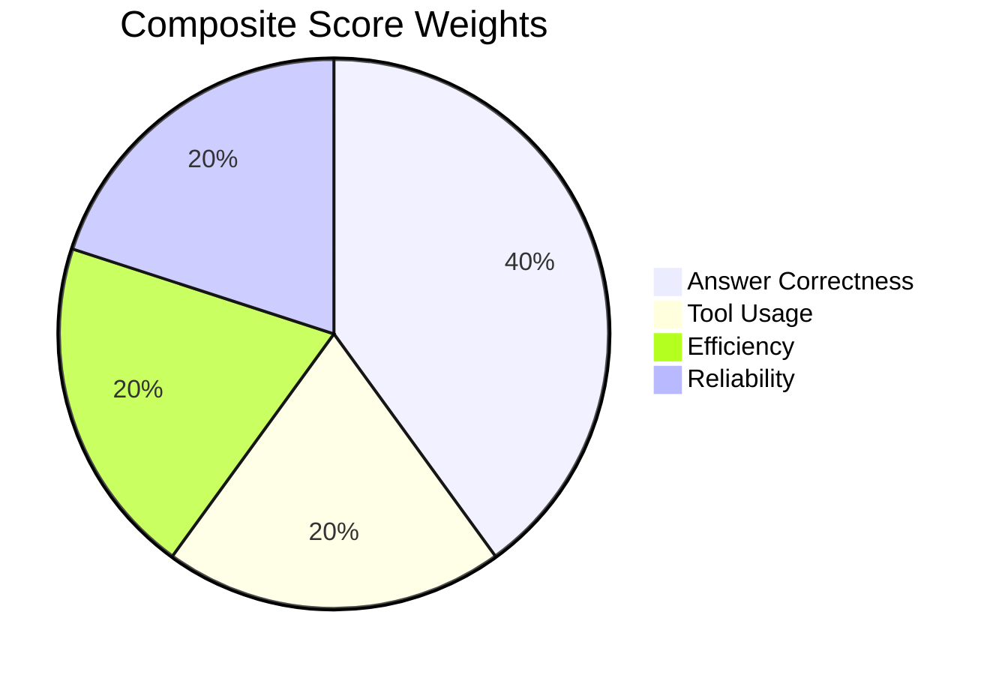

# AgentProbe

**A from-scratch ReAct Agent Observatory** — observe, debug, and benchmark LLM agents with a built-in failure taxonomy, cross-model comparison, and production-grade evaluation harness.

[](https://github.com/pyaesone/agentprobe/actions)


---

## Why This Exists

Most "AI agent" demos are thin wrappers around LangChain. **AgentProbe builds the entire ReAct loop from scratch** — the parser, the tool dispatch, the failure detection, the streaming — so every layer is transparent and observable.

The **failure taxonomy** is the differentiator: every run is annotated with _exactly which failure modes occurred, at which step, and why._ This transforms agent debugging from "it didn't work" into quantified, actionable diagnostics.

---

## Features

| Feature                      | Description                                                                                             |
| ---------------------------- | ------------------------------------------------------------------------------------------------------- |
| **Real-time Playground**     | Type a query, watch the agent reason step-by-step via SSE streaming                                     |
| **8-Type Failure Taxonomy**  | Automatic classification: hallucinated tools, malformed actions, context overflow, goal drift, and more |
| **Multi-Model Benchmarking** | 50+ test cases across 5 categories with composite scoring (answer + tools + efficiency + reliability)   |
| **Cross-Model Compare**      | Side-by-side dual-trace execution on the same query                                                     |
| **5 LLM Providers**          | Groq, Ollama, OpenAI, Anthropic, Google — with dynamic availability detection                           |
| **Analytics Dashboard**      | Failure distributions, model performance heatmaps, KPI overview cards                                   |
| **Custom Tools**             | Build HTTP or static tools via the UI — agent uses them in real-time                                    |
| **Prompt Engineering**       | Create, save, and A/B test custom system prompts                                                        |
| **Agent Memory**             | Persistent key-value memory across runs via save/recall tools                                           |
| **Auth System**              | JWT + API key authentication with per-user data scoping                                                 |
| **Export**                   | CSV and PDF export for benchmark results and run traces                                                 |

---

## Architecture



### Clean Architecture Layers



- **Domain** — Entities (`AgentRun`, `AgentStep`, `User`, `CustomTool`, `MemoryEntry`), enums (`FailureType`, `StepType`), port interfaces (zero external dependencies)
- **Application** — `AgentOrchestrator` (ReAct loop), `EvalHarness`, `ScoringEngine`, `AnalyticsService`, `AuthService`, `ExportService`, Pydantic schemas
- **Infrastructure** — 5 LLM providers, SQLAlchemy persistence (9 tables), tool registry, FastAPI routes, middleware (rate limiter, auth, request validator)

---

## ReAct Agent Loop



Every failure is recorded with its type, step index, and context — enabling the aggregate analytics that power the dashboard.

---

## Failure Taxonomy

The core differentiator. Every run is annotated with exactly which failure modes occurred:



| Failure                | What Happened                      | How It's Detected               |
| ---------------------- | ---------------------------------- | ------------------------------- |
| `hallucinated_tool`    | LLM invented a tool name           | Tool name not in registry       |
| `malformed_action`     | Can't parse Action/Action Input    | Regex parse failure             |
| `tool_execution_error` | Tool threw an exception            | `[ERROR]` prefix in observation |
| `max_steps_exceeded`   | Agent never reached Final Answer   | Step counter >= limit           |
| `context_overflow`     | Context window approaching limit   | Character count check           |
| `repeated_action`      | Same tool + args called twice      | Dedup check on recent steps     |
| `empty_response`       | LLM returned nothing               | Empty string check              |
| `goal_drift`           | Final answer doesn't address query | Keyword overlap analysis        |

---

## Tech Stack



---

## Quick Start

### Docker (recommended)

```bash
# Clone and configure
git clone https://github.com/pyaesone/agentprobe.git
cd agentprobe

# Set API keys
cat > .env << EOF
GROQ_API_KEY=your_key_here
TAVILY_API_KEY=your_key_here
EOF

# Launch full stack (PostgreSQL + Backend + Frontend)
docker-compose up --build

# Frontend: http://localhost:3000
# Backend:  http://localhost:8000
# API Docs: http://localhost:8000/docs
```

### Manual Setup

<details>
<summary>Backend</summary>

```bash
cd backend
python -m venv .venv && source .venv/bin/activate
pip install -e ".[dev]"
cp .env.example .env    # Add your API keys
mkdir workspace
uvicorn main:app --reload --port 8000
```

</details>

<details>
<summary>Frontend</summary>

```bash
cd frontend
npm install
npm run dev              # http://localhost:3000
```

</details>

### API Keys

| Provider  | Free Tier | URL                           |
| --------- | --------- | ----------------------------- |
| Groq      | Yes       | https://console.groq.com      |
| Tavily    | Yes       | https://tavily.com            |
| Ollama    | Local     | https://ollama.com            |
| OpenAI    | Paid      | https://platform.openai.com   |
| Anthropic | Paid      | https://console.anthropic.com |
| Google    | Free      | https://aistudio.google.com   |

---

## API Reference

### Agent Execution

| Method | Endpoint      | Description                  |
| ------ | ------------- | ---------------------------- |
| `POST` | `/api/v1/run` | Start agent run (SSE stream) |

### Run Management

| Method   | Endpoint                   | Description                       |
| -------- | -------------------------- | --------------------------------- |
| `GET`    | `/api/v1/runs`             | List runs (paginated, filterable) |
| `GET`    | `/api/v1/runs/{id}`        | Run detail with full step trace   |
| `DELETE` | `/api/v1/runs/{id}`        | Delete a run                      |
| `GET`    | `/api/v1/runs/{id}/replay` | Replay run as SSE stream          |

### Benchmarking

| Method | Endpoint                         | Description                          |
| ------ | -------------------------------- | ------------------------------------ |
| `GET`  | `/api/v1/benchmarks/cases`       | List benchmark test cases            |
| `POST` | `/api/v1/benchmarks/cases`       | Create custom test case              |
| `POST` | `/api/v1/benchmarks/suites`      | Start benchmark suite (SSE progress) |
| `GET`  | `/api/v1/benchmarks/suites`      | List completed suites                |
| `GET`  | `/api/v1/benchmarks/suites/{id}` | Suite detail with per-case results   |

### Analytics & Providers

| Method | Endpoint                     | Description                       |
| ------ | ---------------------------- | --------------------------------- |
| `GET`  | `/api/v1/analytics/failures` | Failure type breakdown            |
| `GET`  | `/api/v1/analytics/models`   | Cross-model performance stats     |
| `GET`  | `/api/v1/providers`          | Available providers + models      |
| `GET`  | `/api/v1/tools`              | Built-in tool list                |
| `GET`  | `/api/v1/health`             | Health check with provider status |

### Custom Tools & Prompts

| Method   | Endpoint                    | Description            |
| -------- | --------------------------- | ---------------------- |
| `POST`   | `/api/v1/tools/custom`      | Create custom tool     |
| `GET`    | `/api/v1/tools/custom`      | List custom tools      |
| `DELETE` | `/api/v1/tools/custom/{id}` | Delete custom tool     |
| `POST`   | `/api/v1/prompts`           | Create prompt template |
| `GET`    | `/api/v1/prompts`           | List prompt templates  |
| `PUT`    | `/api/v1/prompts/{id}`      | Update prompt template |
| `DELETE` | `/api/v1/prompts/{id}`      | Delete prompt template |

### Auth & Export

| Method | Endpoint                              | Description             |
| ------ | ------------------------------------- | ----------------------- |
| `POST` | `/auth/register`                      | Register new user       |
| `POST` | `/auth/login`                         | Login (returns JWT)     |
| `POST` | `/auth/api-keys`                      | Generate API key        |
| `GET`  | `/auth/me`                            | Current user info       |
| `GET`  | `/api/v1/exports/runs/{id}/csv`       | Export run as CSV       |
| `GET`  | `/api/v1/exports/benchmarks/{id}/csv` | Export benchmark as CSV |
| `GET`  | `/api/v1/exports/benchmarks/{id}/pdf` | Export benchmark as PDF |

---

## Database Schema



9 tables total. SQLite for local development, PostgreSQL for production. Alembic manages migrations.

---

## Project Structure

```
agentprobe/
├── backend/
│   ├── src/agentprobe/
│   │   ├── domain/                  # Zero-dependency core
│   │   │   ├── entities/            # AgentRun, Step, User, CustomTool, Memory, Prompt
│   │   │   └── ports/               # ILLMProvider, IRunRepository, IUserRepository, ...
│   │   ├── application/             # Business logic
│   │   │   ├── services/            # Orchestrator, EvalHarness, Auth, Analytics, Export
│   │   │   └── schemas/             # Pydantic v2 request/response models
│   │   └── infrastructure/          # External integrations
│   │       ├── api/                 # FastAPI app, routes (10 modules), middleware (3)
│   │       ├── providers/           # Groq, Ollama, OpenAI, Anthropic, Google
│   │       ├── persistence/         # SQLAlchemy ORM (9 tables), 4 repositories
│   │       └── tools/               # calculator, web_search, think, read_file, memory, custom
│   ├── tests/                       # 81+ tests (unit, integration, API)
│   ├── alembic/                     # 3 migration files
│   └── pyproject.toml
│
├── frontend/
│   ├── src/
│   │   ├── app/                     # 7 routes (/, /runs, /benchmarks, /analytics, /compare, /prompts, dynamic)
│   │   ├── components/              # 30+ components across 8 modules
│   │   ├── store/                   # Zustand (run-store, compare-store)
│   │   └── lib/                     # API client with SSE streaming
│   ├── e2e/                         # Playwright E2E tests (4 specs)
│   └── playwright.config.ts
│
├── .github/workflows/               # CI (lint, test, build, E2E) + Deploy
├── docker-compose.yml               # PostgreSQL + Backend + Frontend
├── CLAUDE.md                        # Project instructions
└── PRD.md                           # Product requirements
```

---

## Development

```bash
# Backend lint + test + type check
cd backend
ruff check src/ tests/
pytest --cov=src/agentprobe
mypy src/

# Frontend lint + build + E2E
cd frontend
npm run lint
npm run build
npm run e2e
```

---

## Scoring Engine

Benchmark cases are scored with a weighted composite:



- **Answer Correctness (40%)** — Keyword overlap between agent's answer and expected answer
- **Tool Usage (20%)** — Did the agent use the expected tools?
- **Efficiency (20%)** — Fewer steps = higher score
- **Reliability (20%)** — No failures = full score; each failure type deducts proportionally

---

## Roadmap

- [x] **Phase 1** — Clean Architecture, Groq + Ollama, SSE streaming, 6 tables
- [x] **Phase 2** — Benchmarking (50+ cases), analytics dashboard, composite scoring
- [x] **Phase 3** — Multi-model compare, Docker Compose, 81 tests
- [x] **Phase 4** — PostgreSQL + Alembic, rate limiting, request validation
- [x] **Phase 5** — OpenAI, Anthropic, Google providers + dynamic discovery
- [x] **Phase 6** — Auth (JWT + API keys), GitHub Actions CI/CD
- [x] **Phase 7** — Custom tools, prompt engineering UI, agent memory
- [x] **Phase 8** — Vercel + Railway deploy, Playwright E2E, CSV/PDF export

---

## License

MIT
